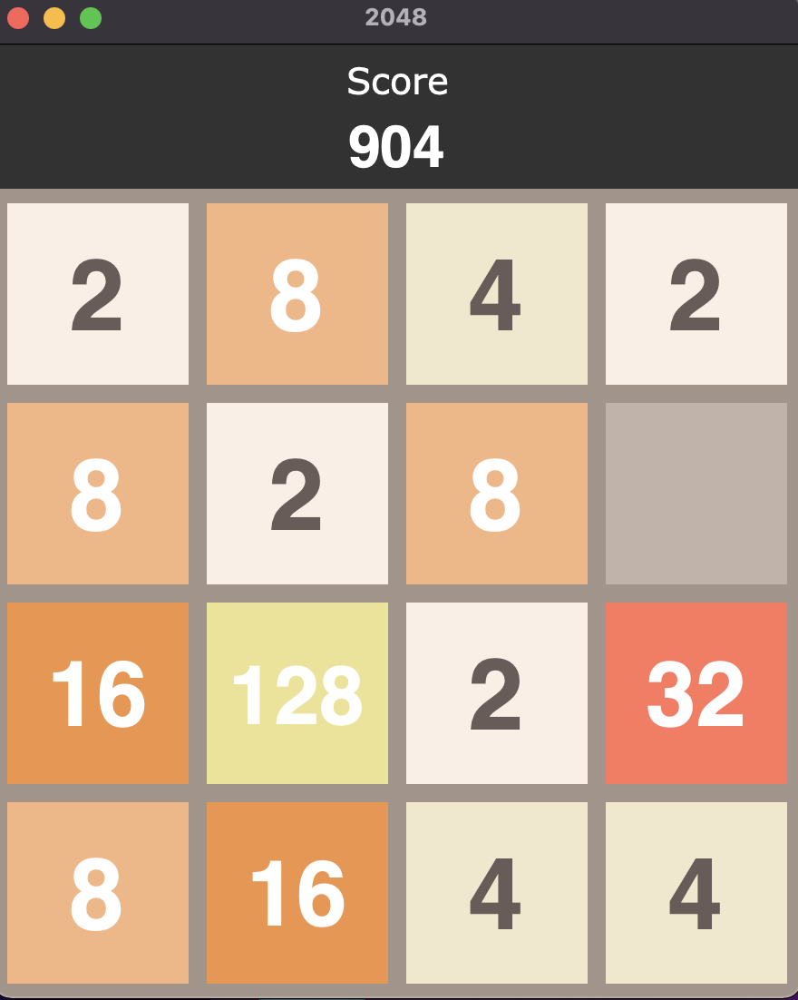

# 2048-python
A Python implementation of 2048 using the graphical user interface [tkinter](https://docs.python.org/3/library/tkinter.html).

2048 is a single-player sliding tile puzzle video game written by Italian web developer Gabriele Cirulli where the objective is to slide numbered tiles on a grid to combine them to create a tile with the number 2048.

## Game Rules
1. 2048 is played on a plain 4×4 grid, with numbered tiles that slide when a player moves them using the four arrow keys.
2. Every turn, a new tile randomly appears in an empty spot on the board with a value of either 2 or 4.
3. Tiles slide as far as possible in the chosen direction until they are stopped by either another tile or the edge of the grid. 
4. If two tiles of the same number collide while moving, they will merge into a tile with the total value of the two tiles that collided.
5. If If a move causes three consecutive tiles of the same value to slide together, only the two tiles farthest along the direction of motion will combine. 
6. If all four spaces in a row or column are filled with tiles of the same value, a move parallel to that row/column will combine the first two and last two.
7. The resulting tile cannot merge with another tile again in the same move. 
8. The game is won when a tile with a value of 2048 appears on the board.
